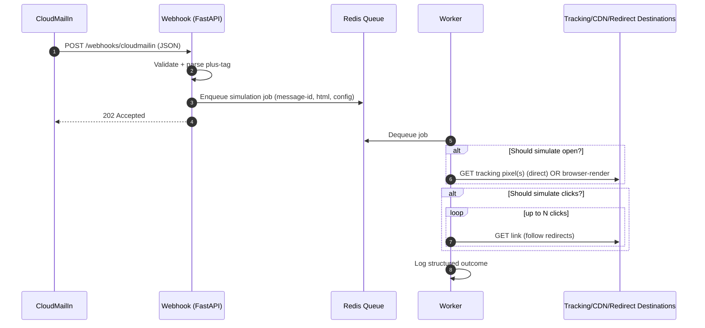

## PRD: CloudMailIn Email Behavior Simulator (Heroku, Python)

### Overview
- **Goal**: Simulate realistic customer behavior (opens and clicks) for marketing emails received via CloudMailIn, running on Heroku with a background worker dyno in Python.
- **Key idea**: Each “customer” shares a single mailbox but uses plus-addressing to create unique, ephemeral addresses (e.g., `c96be77c591e99f5c6bf+testbot1@cloudmailin.net`).
- **Trigger**: CloudMailIn POSTs inbound email payloads (JSON) to our webhook. We enqueue a job to randomly simulate an email open and optionally one or more link clicks.
- **Reference**: Receiving email with CloudMailIn and Heroku [link](https://devcenter.heroku.com/articles/cloudmailin#receiving-email-with-heroku).

### In-Scope
- **Webhook ingestion**: Accept CloudMailIn JSON (HTML, headers, envelope, attachments metadata) and immediately enqueue processing.
- **Open simulation**: Random chance to “open” by fetching email tracking pixel resources. Default strategy is direct HTTP GET of image/remote pixel assets; optional headless browser for full HTML rendering.
- **Click simulation**: Randomly select 0..N links within the HTML and fetch them to simulate clicks (tracking platforms typically log on redirect).
- **Plus-addressing support**: Extract customer identity from `envelope.to` local part’s `+tag` (e.g., `...+customer123@...`).
- **Operationalization**: Heroku deployment with a background worker dyno; optional light web dyno for webhook. Config flags to tune probabilities, timings, link limits, and choice of strategy.

### Out-of-Scope
- Persisting long-term user state or analytics beyond operational logs.
- Sophisticated human-like navigation beyond timed delays and randomized selection.
- Deliverability or outbound email sending.

## Requirements

### Functional Requirements
1. **Receive inbound emails via CloudMailIn**
   - Provide an HTTPS POST endpoint (e.g., `/webhooks/cloudmailin`) to receive CloudMailIn JSON payloads.
   - Validate the payload minimally and acknowledge with `202 Accepted` on queueing.
   - Extract the target customer identifier from `mail.envelope.to` by parsing the plus tag.

2. **Randomly simulate an open**
   - Probability configured via `SIMULATE_OPEN_PROBABILITY` (0.0–1.0).
   - Strategy A (default): Parse the HTML for remote `img` resources that resemble tracking pixels (1×1 or common tracking endpoints) and `GET` them with a realistic `User-Agent`.
   - Strategy B (optional): Render the HTML in a headless browser (Playwright) to load resources that trigger open tracking automatically; controlled by `SIMULATE_WITH_BROWSER`.

3. **Randomly simulate click(s)**
   - Probability (`SIMULATE_CLICK_PROBABILITY`) and max count (`MAX_CLICKS`) are configurable.
   - Parse `<a href>` links, de-duplicate, optionally filter by domain allow/deny lists.
   - Fetch selected links using HTTP GET with realistic headers; follow redirects.

4. **Delays & jitter**
   - Add configurable human-like delays before open and between clicks (`OPEN_DELAY_RANGE_MS`, `CLICK_DELAY_RANGE_MS`).

5. **Idempotency**
   - Deduplicate by `headers.message_id` (and fallback hash of subject+date) using a short-lived key in Redis to avoid reprocessing the same email.

6. **Observability**
   - Structured JSON logging for all major events (enqueued, opened, clicked, errors), including customer tag, message-id, chosen strategies, and timing.
   - Health check endpoint (e.g., `/health`) for liveness.

7. **Security**
   - Optional shared secret (e.g., `X-Webhook-Secret`) required on webhook.
   - Validate `envelope.to` domain matches `cloudmailin.net` and that local part base matches the configured forward address local part.
   - Reject payloads over a maximum size threshold; ignore attachments by default (no writes to disk).

### Non-Functional Requirements
- **Scalability**: Webhook must return quickly (<200ms typical) by enqueueing to a worker dyno. Worker concurrency adjustable (`WORKER_CONCURRENCY`).
- **Reliability**: Retry transient HTTP fetch failures with exponential backoff (bounded attempts). Consider per-domain backoff.
- **Performance**: Fast-path “open” via direct pixel fetch; headless mode incurs higher CPU/memory, reserved for specific scenarios.
- **Cost**: Default to direct-fetch strategy to avoid browser overhead; enable Playwright only when needed.
- **Compliance/Privacy**: Do not store email content long-term. No PII persisted. Logs scrub headers/body beyond necessary metadata.

## Architecture

### Components
- **Webhook (web dyno, Python/FastAPI)**: Receives CloudMailIn payloads; validates and enqueues jobs to Redis.
- **Worker (worker dyno, Python)**: Dequeues jobs, performs open/click simulation via requests (or Playwright if enabled).
- **Redis (Heroku Redis add-on)**: Queue and idempotency keys.
- **CloudMailIn (Heroku add-on)**: Forwards inbound email as JSON to webhook.

### Sequence Diagram


## Configuration

### Environment Variables
- **CLOUDMAILIN_FORWARD_ADDRESS**: Shared mailbox (provided): `c96be77c591e99f5c6bf@cloudmailin.net`
- **WEBHOOK_SECRET**: Optional shared secret; if set, requests must include `X-Webhook-Secret` header.
- **REDIS_URL**: Provided by Heroku Redis.
- **SIMULATE_WITH_BROWSER**: `true|false` (default `false`).
- **SIMULATE_OPEN_PROBABILITY**: `0.0..1.0` (default `0.7`).
- **SIMULATE_CLICK_PROBABILITY**: `0.0..1.0` (default `0.3`).
- **MAX_CLICKS**: Integer (default `2`).
- **OPEN_DELAY_RANGE_MS**: e.g., `500,5000` (min,max).
- **CLICK_DELAY_RANGE_MS**: e.g., `300,4000` (min,max).
- **USER_AGENT_POOL**: Optional comma-separated list of user-agents; otherwise rotate sensible defaults.
- **LINK_DOMAIN_ALLOWLIST**: Optional CSV (only click these domains).
- **LINK_DOMAIN_DENYLIST**: Optional CSV (never click these domains).
- **WORKER_CONCURRENCY**: e.g., `5`.
- **REQUEST_TIMEOUT_MS**: Per-GET timeout (default `8000`).

### Heroku Resources
- CloudMailIn add-on
- Heroku Redis add-on
- Dynos: 1× `web` (small), 1× `worker` (scale as needed)

### CloudMailIn Setup
- Provision add-on and set target URL to your webhook, e.g. `/webhooks/cloudmailin`.
- Reference: [Heroku CloudMailIn receiving email](https://devcenter.heroku.com/articles/cloudmailin#receiving-email-with-heroku).

## Implementation Plan (Python)

### Tech Choices
- **FastAPI** for webhook (fast, type hints, built-in validation via Pydantic).
- **RQ** for a simple Redis-backed queue for jobs (`rq` + `redis`).
- **HTTP clients**: `httpx` for async/timeout/retries; or `requests` for simplicity (choose `httpx`).
- **HTML parsing**: `beautifulsoup4` to extract `img` and `a` tags.
- **Optional headless**: `playwright` (Chromium). Enable via flag. Requires installing browsers in build.

### Project Structure
```text
app/
  __init__.py
  config.py
  logging.py
  web.py                 # FastAPI app, routes
  models.py              # Pydantic types for CloudMailIn payload
  queue.py               # RQ setup
  worker.py              # RQ worker entrypoint and job handlers
  simulate/
    __init__.py
    openers.py           # open simulation strategies (direct, playwright)
    clickers.py          # link selection + GET/follow
    html_parse.py        # soup helpers
  utils/
    idempotency.py       # message-id keys in Redis
    user_agents.py       # rotation
  tests/
    unit/
    integration/
    e2e/
Procfile
runtime.txt
requirements.txt
```

### Webhook Contract
- **POST** `/webhooks/cloudmailin`
  - Headers: `Content-Type: application/json`, optional `X-Webhook-Secret: <secret>`
  - Body: CloudMailIn JSON (subset used: `headers`, `envelope`, `plain`, `html`, `attachments`)
  - Response: `202 Accepted` with `{ "status": "enqueued", "message_id": "..." }`

### Ingestion Flow
1. Validate secret (if present), content-type, payload shape.
2. Parse `envelope.to`: base local part must match `CLOUDMAILIN_FORWARD_ADDRESS` local; plus-tag (if present) is the customer key.
3. Compute idempotency key from `headers.message_id` (fallback hash).
4. If duplicate (recent), return `202` but skip enqueue; else enqueue job with payload metadata and html.

### Simulation Flow (Worker)
1. Sleep random delay within `OPEN_DELAY_RANGE_MS`.
2. With probability `SIMULATE_OPEN_PROBABILITY`, perform open:
   - Direct strategy: extract remote `img` URLs; fetch with randomized headers; log status.
   - Browser strategy: launch Chromium (headless), load in-memory HTML via data URL or `page.set_content`; wait for network idle or timeout; close.
3. With probability `SIMULATE_CLICK_PROBABILITY`, select up to `MAX_CLICKS` links; apply allow/deny filters; shuffle and pick; for each:
   - Sleep a random delay within `CLICK_DELAY_RANGE_MS`.
   - Fetch link and follow redirects (bounded); log final URL chain and status.
4. Mark job done; write structured log line with outcomes and timings.

### Error Handling & Retries
- Use bounded retries on transient network errors.
- Guard against headless startup failure; fallback to direct strategy.
- Protect against HTML parsing errors; treat as empty.

### Idempotency
- Use Redis `SETNX` (or `SET` with NX + TTL) for message-id key with a TTL (e.g., 1 day). Skip processing if key exists.

### Security Hardening
- Require `WEBHOOK_SECRET` for production.
- Enforce payload size limit at ASGI server level.
- Strip/ignore attachments; never write to disk.

### Deployment
- `Procfile`:
```procfile
web: gunicorn app.web:app -k uvicorn.workers.UvicornWorker --log-level info
worker: rq worker --url $REDIS_URL email_simulator
```
- Buildpacks:
  - Python
  - If using Playwright: add a Playwright-compatible buildpack and run `playwright install --with-deps chromium` at build.
- Config Vars: set variables listed above.
- CloudMailIn Target: set to `https://<app>.herokuapp.com/webhooks/cloudmailin`.

### Requirements (indicative)
```txt
fastapi
uvicorn[standard]
httpx
beautifulsoup4
redis
rq
python-json-logger
pydantic
# Optional headless
playwright
```

### Example: Minimal FastAPI Webhook
```python
from fastapi import FastAPI, Header, HTTPException
from pydantic import BaseModel
import os
from rq import Queue
from redis import Redis

app = FastAPI()
redis_conn = Redis.from_url(os.environ["REDIS_URL"])  # Heroku Redis
queue = Queue("email_simulator", connection=redis_conn)
WEBHOOK_SECRET = os.getenv("WEBHOOK_SECRET")
FORWARD_ADDR = os.getenv("CLOUDMAILIN_FORWARD_ADDRESS", "")

class Envelope(BaseModel):
    to: str

class IncomingMail(BaseModel):
    envelope: Envelope
    headers: dict | None = None
    html: str | None = None

@app.post("/webhooks/cloudmailin")
async def cloudmailin_webhook(x_webhook_secret: str | None = Header(default=None), mail: IncomingMail = None):
    if WEBHOOK_SECRET and x_webhook_secret != WEBHOOK_SECRET:
        raise HTTPException(status_code=401, detail="unauthorized")

    # Basic local-part validation against configured forward address
    if FORWARD_ADDR and FORWARD_ADDR.split("@")[0] not in mail.envelope.to:
        raise HTTPException(status_code=400, detail="invalid recipient")

    message_id = (mail.headers or {}).get("message_id")
    # Enqueue the job with the minimal required data
    job = queue.enqueue("app.worker.process_mail", {
        "message_id": message_id,
        "to": mail.envelope.to,
        "html": mail.html,
    })
    return {"status": "enqueued", "message_id": message_id, "job_id": job.id}
```

### Example: Direct Open + Click (sketch)
```python
import httpx, random, time
from bs4 import BeautifulSoup

async def simulate_open_and_click(html: str, ua: str, open_p: float, click_p: float, max_clicks: int,
                                  open_delay_ms: tuple[int, int], click_delay_ms: tuple[int, int], timeout_ms: int):
    if not html:
        return {"opened": False, "clicked": 0}

    soup = BeautifulSoup(html, "html.parser")
    headers = {"User-Agent": ua, "Accept": "*/*"}
    timeout = httpx.Timeout(timeout_ms / 1000)

    opened = False
    if random.random() < open_p:
        time.sleep(random.randint(*open_delay_ms) / 1000)
        img_srcs = [img.get("src") for img in soup.find_all("img") if img.get("src")]
        async with httpx.AsyncClient(timeout=timeout, follow_redirects=True, headers=headers) as client:
            for src in img_srcs[:5]:  # cap fetches
                try:
                    await client.get(src)
                    opened = True
                except Exception:
                    pass

    clicks = 0
    if random.random() < click_p:
        links = list({a.get("href") for a in soup.find_all("a") if a.get("href")})
        random.shuffle(links)
        async with httpx.AsyncClient(timeout=timeout, follow_redirects=True, headers=headers) as client:
            for href in links[:max_clicks]:
                time.sleep(random.randint(*click_delay_ms) / 1000)
                try:
                    await client.get(href)
                    clicks += 1
                except Exception:
                    pass

    return {"opened": opened, "clicked": clicks}
```

## Testing Strategy

### Unit Tests
- HTML parser extracts links/images correctly.
- Plus-tag parser for `envelope.to` handles edge cases (no tag, multiple pluses, invalid chars).
- Idempotency key creation and Redis interactions.
- Probability gates and delay windows respected.

### Integration Tests
- Webhook accepts CloudMailIn example JSON and enqueues a job.
- Worker consumes queue and performs direct open/click fetches against a local test server (records GETs and redirects).

### E2E Tests
- Spin up FastAPI + Redis + a small HTTP test target. POST a fixture CloudMailIn payload; assert:
  - 202 on webhook
  - Open GETs (for images) received (if probability forced to 1.0)
  - Click GETs and redirect chains received (if forced)
- Optional: Headless path behind a feature flag (run selectively in CI due to resource/time).

### Test Tooling
- `pytest`, `pytest-asyncio`, `respx` or a local test server for capturing requests.
- Avoid mocking core HTTP flows in E2E; use real components.

## Acceptance Criteria
- Webhook reliably accepts CloudMailIn POSTs and enqueues jobs.
- Worker processes jobs with configurable probabilities and limits.
- Open simulation via direct fetch works; optional headless path can be enabled.
- Click simulation fetches selected links and follows redirects.
- Structured logs include customer tag, message-id, chosen actions, and timing.
- Idempotency prevents duplicate processing within TTL.
- Deployable on Heroku with `web` and `worker` dynos; documented configuration.

## Risks & Mitigations
- **Headless overhead**: Use direct-fetch default; enable Playwright only when required.
- **Tracking nuances**: Some platforms require image loads from specific origins; broaden image fetch selection.
- **Rate limiting**: Implement backoff; cap concurrent clicks; per-domain pacing.
- **Webhook exposure**: Require shared secret; consider IP allowlisting at WAF/edge.

## Operations & Monitoring
- Heroku logs with JSON formatter; filter by `message_id` or `customer_tag`.
- Health probe on `/health` (web) and worker heartbeat logs.
- Alert on job failure rate > threshold or repeated headless failures.

## Future Enhancements
- Plug-in scoring for varied user personas (mobile vs desktop UAs, geos, time-of-day patterns).
- Domain heuristics for prioritizing “primary call-to-action” links.
- Persist minimal analytics to a datastore for reporting.

## References
- Heroku CloudMailIn: Receiving Email with Heroku — [devcenter.heroku.com/articles/cloudmailin#receiving-email-with-heroku](https://devcenter.heroku.com/articles/cloudmailin#receiving-email-with-heroku)

---

### Appendix A: Sample CloudMailIn JSON (trimmed)
```json
{
  "headers": {
    "message_id": "<4F145791.8040802@example.com>",
    "subject": "Test Subject"
  },
  "envelope": {
    "to": "c96be77c591e99f5c6bf+testbot1@cloudmailin.net"
  },
  "html": "<html><body><a href=\"https://redirect.emailplatform/click?u=abc\">Buy now</a></body></html>"
}
```

### Appendix B: Heroku Provisioning (example)
```bash
# Create app, add addons
heroku create
heroku addons:create cloudmailin --target=https://<app>.herokuapp.com/webhooks/cloudmailin
heroku addons:create heroku-redis:hobby-dev

# Config vars
heroku config:set CLOUDMAILIN_FORWARD_ADDRESS=c96be77c591e99f5c6bf@cloudmailin.net \
  SIMULATE_OPEN_PROBABILITY=0.7 SIMULATE_CLICK_PROBABILITY=0.3 MAX_CLICKS=2 \
  OPEN_DELAY_RANGE_MS=500,5000 CLICK_DELAY_RANGE_MS=300,4000 REQUEST_TIMEOUT_MS=8000 \
  WORKER_CONCURRENCY=5 WEBHOOK_SECRET=change-me

# Deploy normally with your CI/CD
```
