# BobNet Architecture Diagrams

This document contains comprehensive Mermaid diagrams illustrating the BobNet email simulation system.

## Table of Contents

1. [System Overview](#system-overview)
2. [Request Flow](#request-flow)
3. [Queue Message Types](#queue-message-types)
4. [Simulation Decision Flow](#simulation-decision-flow)
5. [HTML Override System](#html-override-system)
6. [Component Architecture](#component-architecture)
7. [Deployment Architecture](#deployment-architecture)

---

## System Overview

High-level view of the BobNet system architecture showing the three-binary design with two RabbitMQ queues.

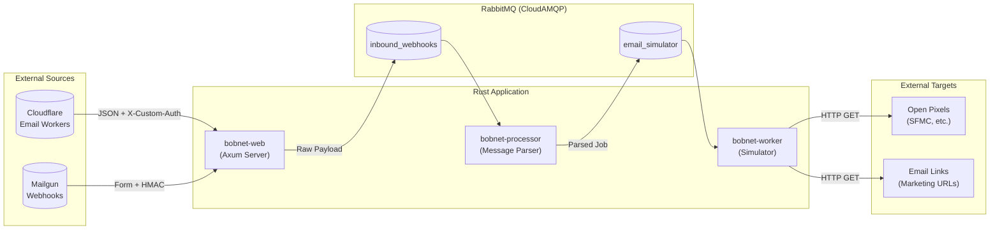

---

## Request Flow

Detailed sequence diagram showing how an inbound email webhook flows through the system.

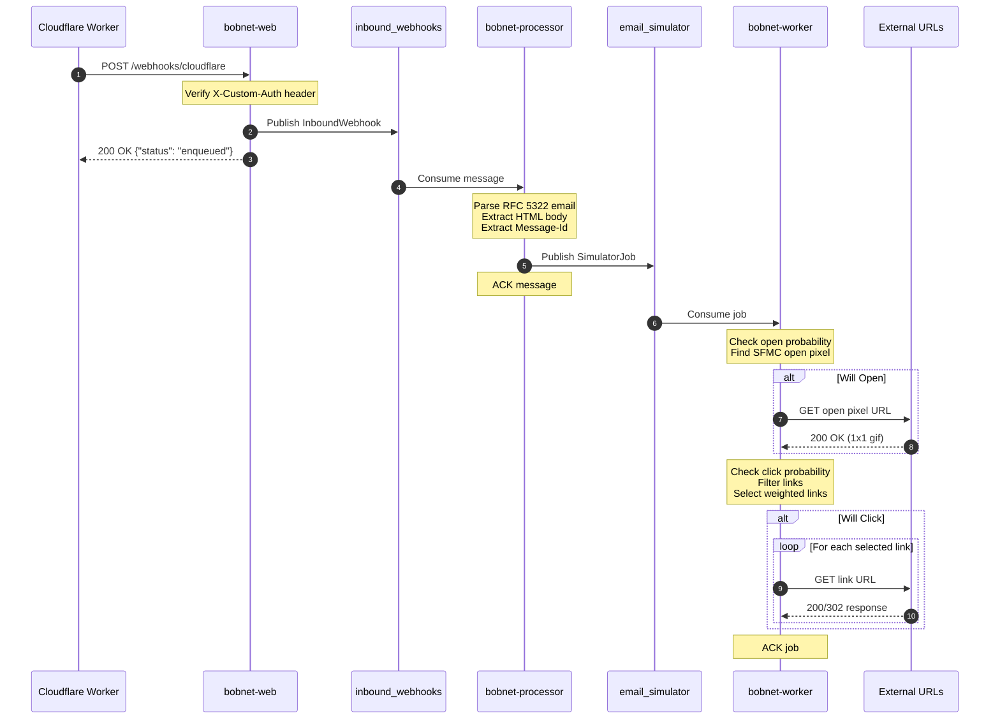

---

## Queue Message Types

Entity relationship diagram showing the structure of messages in each queue.

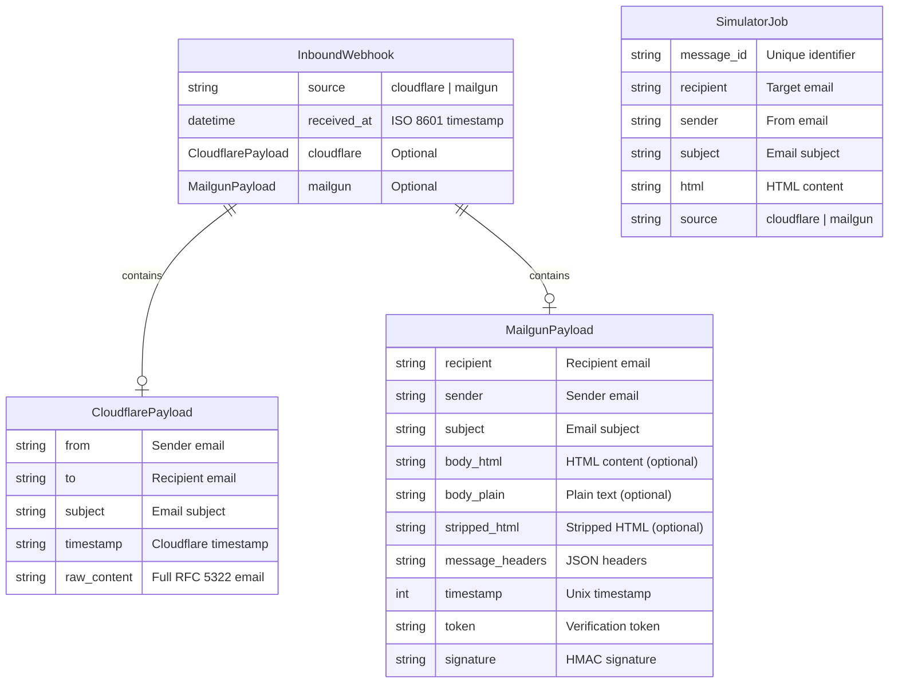

---

## Simulation Decision Flow

Flowchart showing the decision logic for open and click simulation.

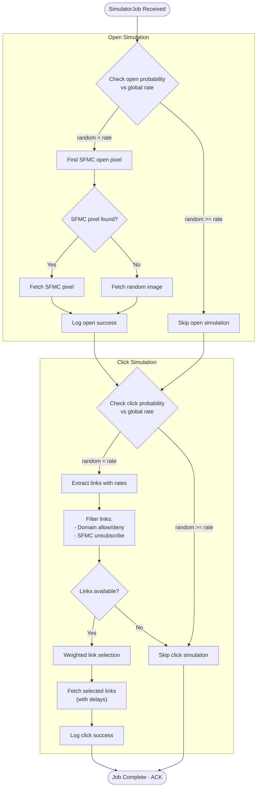

---

## HTML Override System

Diagram showing how HTML-based rate overrides work.

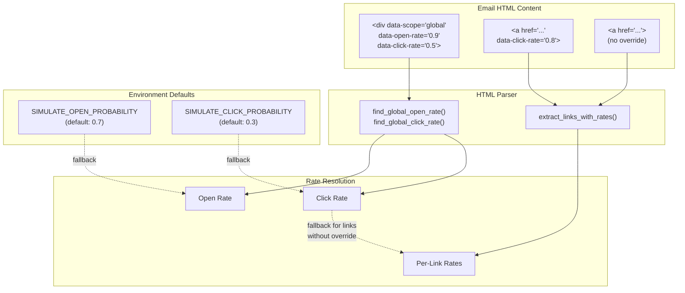

### SFMC Open Pixel Detection

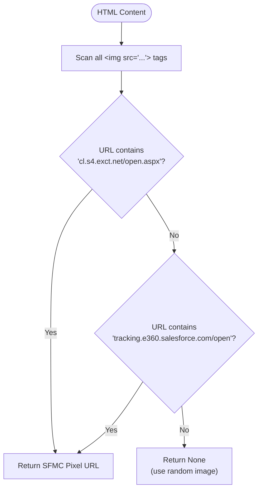

### SFMC Unsubscribe Link Filtering

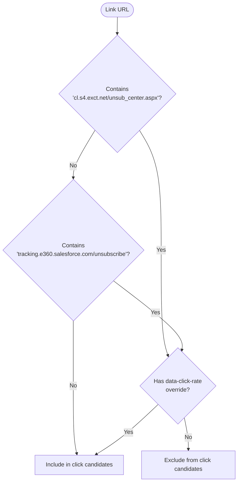

---

## Component Architecture

Class diagram showing the internal structure of each Rust binary.

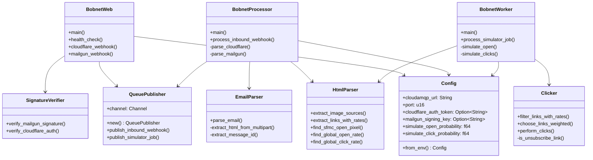

---

## Deployment Architecture

Deployment diagram showing the Heroku infrastructure.

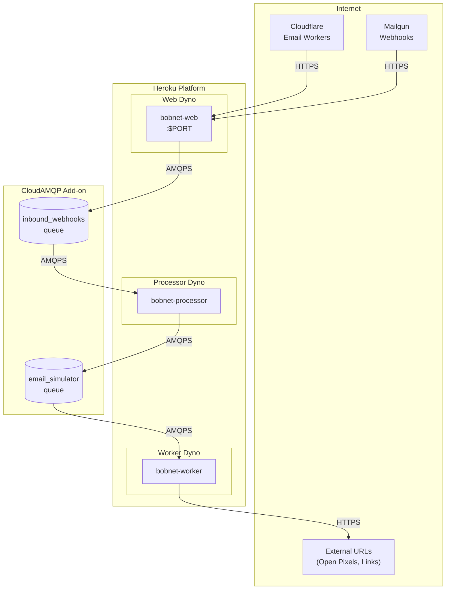

### Procfile Configuration

```
web: ./rust-worker/target/release/bobnet-web
processor: ./rust-worker/target/release/bobnet-processor
rust-worker: ./rust-worker/target/release/bobnet-worker
```

### Environment Variables

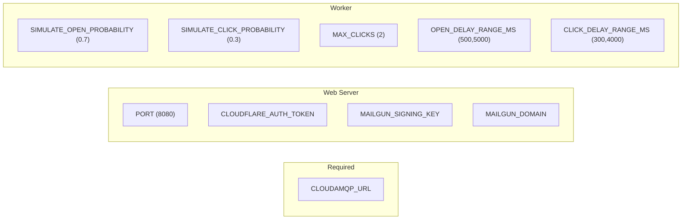

---

## Performance Characteristics

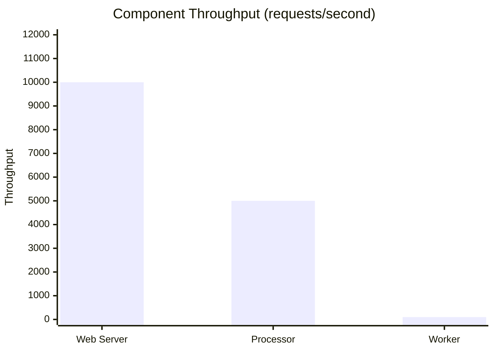

| Component | Throughput | Latency | Bottleneck |
|-----------|------------|---------|------------|
| Web Server | 10,000+ req/sec | Sub-millisecond | None (async I/O) |
| Processor | 5,000+ msg/sec | ~1ms per message | Email parsing |
| Worker | 100+ items/sec | Variable | External network I/O |
