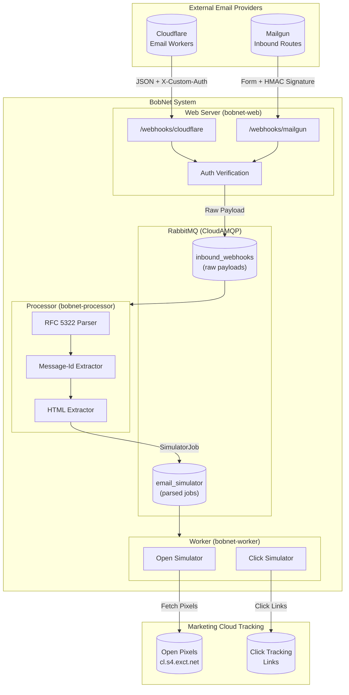
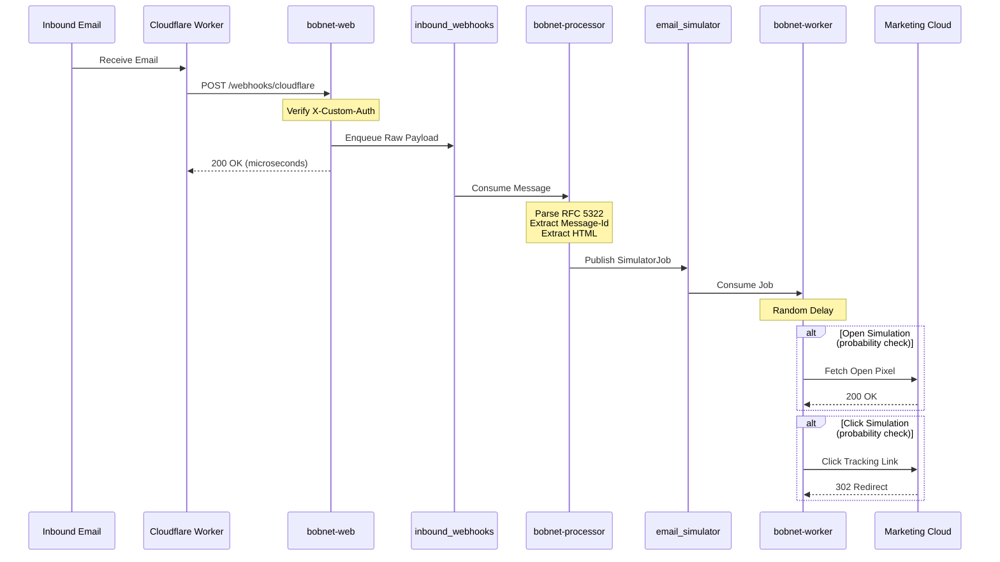
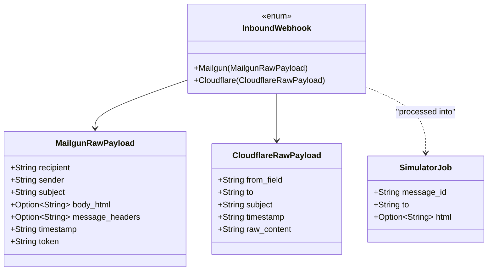
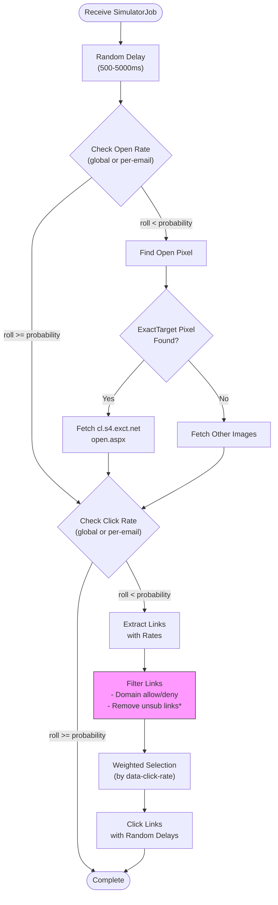
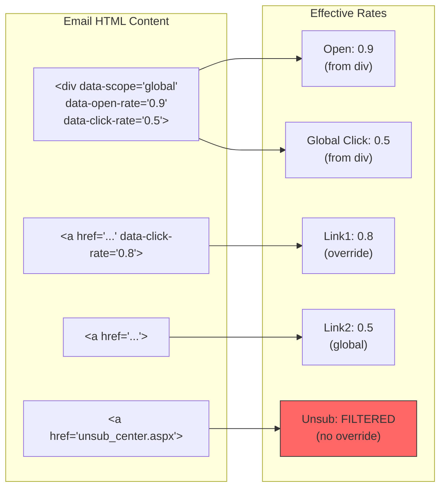
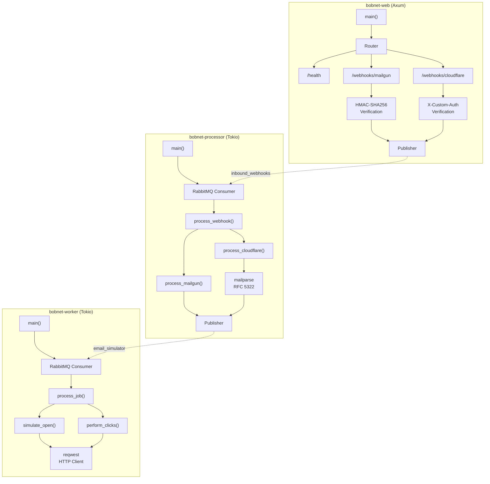
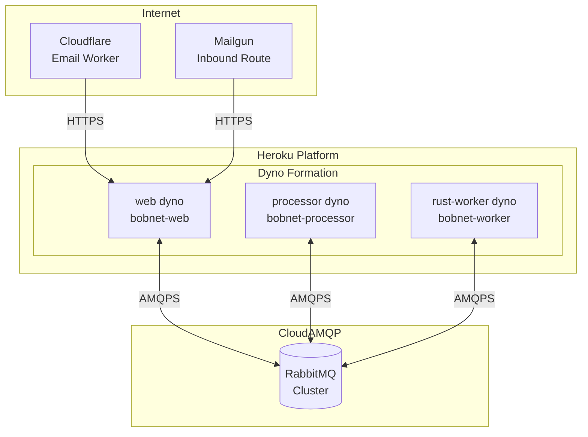

# BobNet Architecture Diagrams

## System Overview

## Request Flow

## Queue Message Types

## Simulation Decision Flow

## HTML Override System

## Component Architecture

## Deployment Architecture (Heroku)

---

*Generated for BobNet Email Simulator - High-performance email simulation system*
